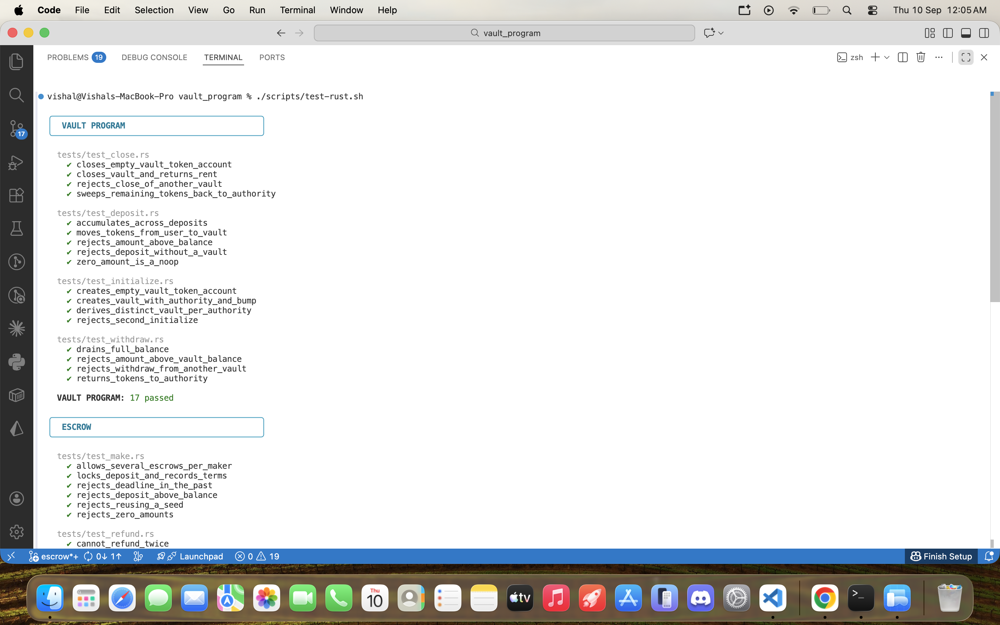
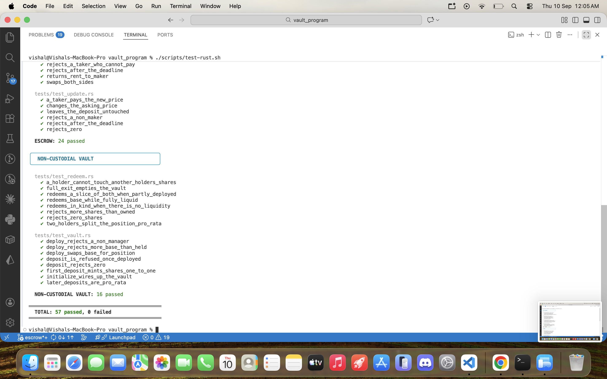
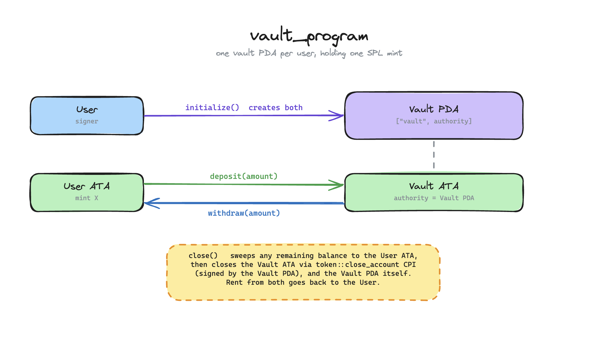
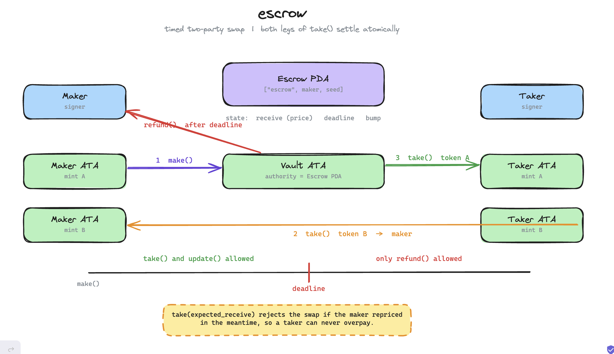
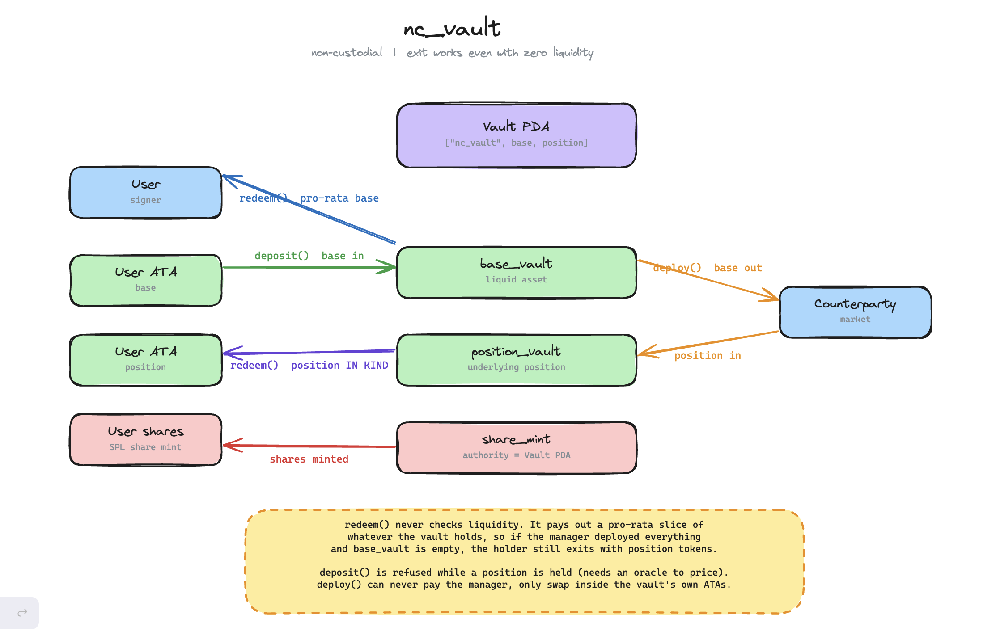

# Solana Vault & Escrow

Three Anchor programs in one workspace, tested with [LiteSVM](https://github.com/LiteSVM/litesvm).

| Program | What it does |
| --- | --- |
| `vault_program` | Per-user token vault: deposit, withdraw, close |
| `escrow` | Timed two-party token swap |
| `nc_vault` | Non-custodial vault where holders can always exit |

## Assignment checklist

- [x] **1. Vault program with `withdraw` and `close`** — `programs/vault_program`
  - `initialize`, `deposit`, `withdraw`, `close`
  - `close` sweeps any remaining balance back to the user, then closes both accounts
- [x] **2. Escrow program with all instructions** — `programs/escrow`
  - `make`, `take`, `refund`, `update`
- [x] **3. Tests covering all instructions with LiteSVM**
  - 57 Rust tests across all three programs, plus 17 TypeScript tests
  - No validator needed — every suite runs against an in-process VM
- [x] **4. Timed escrow using the clock sysvar** *(extension)*
  - `deadline: i64` on the escrow, checked with `Clock::get()?.unix_timestamp`
  - `take` before the deadline, `refund` only after it
- [x] **5. Non-custodial vault, redeemable in kind** *(advanced extension)*
  - `programs/nc_vault` — `redeem` pays a pro-rata slice of whatever the vault
    holds, so a holder exits even when there is zero liquid base

## Setup

```bash
anchor build     # required first — the tests load the compiled .so files
npm install
```

## Running tests

```bash
./scripts/test-rust.sh   # all 57 Rust tests, grouped per program
npm test                 # 17 TypeScript tests (vault_program)
```

The two suites are independent — the script runs `cargo test` only.

| Program | Rust | TypeScript |
| --- | --- | --- |
| `vault_program` | 17 | 17 |
| `escrow` | 24 | — |
| `nc_vault` | 16 | — |
| **Total** | **57** | **17** |

TypeScript covers `vault_program`; the other two are covered in Rust.

### All tests passing





## vault_program



A vault PDA per user, seeded `["vault", authority]`, holding one SPL mint in an
associated token account.

| Instruction | Notes |
| --- | --- |
| `initialize` | Creates the vault and its token account |
| `deposit` | Moves tokens from the user into the vault |
| `withdraw` | Vault PDA signs the transfer back out |
| `close` | Sweeps any remaining balance to the user, then closes both accounts |

`close` closes the token account with a `token::close_account` CPI rather than
Anchor's `close =` constraint. The constraint only works on accounts your own
program owns, and an ATA belongs to the SPL Token program — using it there fails
at runtime with `ExternalAccountLamportSpend`.

## escrow



Maker locks token A and names a price in token B. Both legs of the swap settle
in a single instruction, so neither side can be left short.

| Instruction | Notes |
| --- | --- |
| `make` | Locks the deposit, sets `receive` and a `deadline` |
| `take` | Before the deadline only |
| `refund` | After the deadline only — the offer is binding until it expires |
| `update` | Maker reprices; the deposit is untouched |

The escrow PDA is seeded `["escrow", maker, seed]`, so one maker can run several
at once.

**Timed mechanism (task 4).** Every deadline check reads
`Clock::get()?.unix_timestamp`. `make` rejects a deadline in the past, `take`
and `update` work only before it, and `refund` only after — so the maker cannot
pull an offer out from under a taker while it is still live. The tests move the
clock with `set_sysvar` to cover both sides of each boundary.

`take(expected_receive)` also rejects the swap if the maker repriced in the
meantime, so a taker can never overpay.

## nc_vault



A vault over two assets: the liquid `base` token users deposit, and a
`position` token representing an underlying market position. Shares are a real
SPL mint, so supply always matches what holders own.

| Instruction | Notes |
| --- | --- |
| `initialize` | Opens the vault, share mint, and both token accounts |
| `deposit` | Base in, shares minted pro-rata |
| `deploy` | Manager swaps base for the position with a counterparty |
| `redeem` | Burns shares for a pro-rata slice of base **and** position |

`redeem` never checks liquidity. It pays out a proportional share of whatever
the vault currently holds, so if the manager has deployed everything, a holder
still exits — they receive the position in kind:

```rust
env.deploy(&manager, &cp, 1_000, 500).unwrap();
assert_eq!(env.balance(&env.base_vault()), 0);    // no liquid base

env.redeem(&user, 400).unwrap();                  // still succeeds

assert_eq!(env.balance(&user_position_ata), 200); // paid in kind
```

Two deliberate limits:

- **`deposit` is refused while the vault holds a position.** Pricing a deposit
  against a live position needs an oracle, so deposits are only accepted while
  the vault is fully liquid. Exiting is unrestricted.
- **`deploy` cannot pay the manager**, only swap within the vault's own token
  accounts, and it needs the counterparty's signature. A manager colluding with
  a counterparty could still trade at a bad rate; bounding that would need a
  market whitelist or a price oracle, neither of which is implemented.

## Layout

```
programs/
  vault_program/     src/ + tests/     Rust LiteSVM tests
  escrow/            src/ + tests/
  nc_vault/          src/ + tests/
tests/               TypeScript LiteSVM tests (vault_program)
docs/                diagrams + test screenshots
scripts/test-rust.sh
```

Diagrams are editable — `docs/programs.excalidraw` opens at
[excalidraw.com](https://excalidraw.com).
